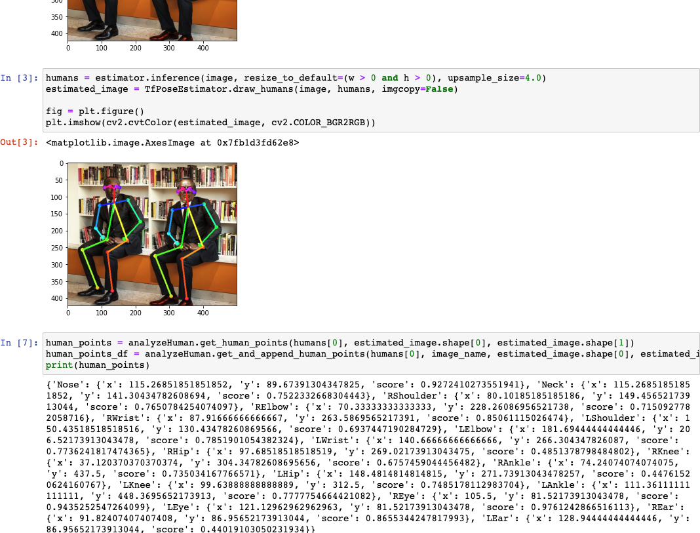

# tf-pose-estimation-with-docker

tf-pose-estimation directory is from https://github.com/ildoonet/tf-pose-estimation (Thanks)

## setup

```bash
# build
docker build -t tf-pose-estimation-with-docker .
# run
docker run -it -p 8888:8888 tf-pose-estimation-with-docker
```

You can analyze with

- estimate_image_sample.ipynb
- estimate_video_sample.ipynb

in JupyterNotebook

### analyzed Data

You can get

- Analyzed images
- Analyzed videos
- Analyzed data like nose positons

you can save analyzed data to local

```bash
# When you analyzed
docker container ls
docker cp <CONTAINER ID>:/usr/src/app/outputs/ ./outputs/
```

### demo

